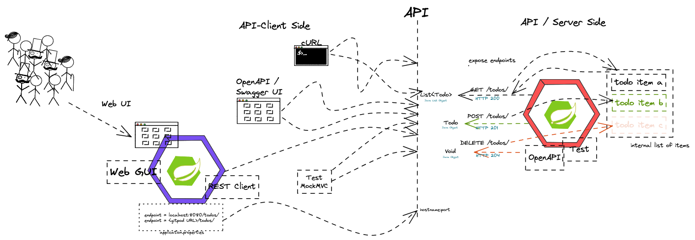

# Distributed Systems Lecture - Winter Semester 2022 - HSE

## Session 26-Sep-2022 Distributed Systems & Cloud Computing Introduction

### Intro questions:

* Which technologies or what do you have in mind in general if you think about "distributed systems"?
* the "WHY" - Why would people use and implement a distributed systems architecture?


### Content

* Why distributed systems?
* What is Cloud Computing? Encounters in everyday life and history
* Characteristic, advantages & challenges
* Terminology - public, private, hybrid, dedicated
* Abstraction layers - IaaS, PaaS, FaaS, SaaS
* Overview - Hypervisors, virtual machines, containers and orchestration

### Objectives and exercises
_The student is able to describe the reasons for distributed systems and
cloud computing in own words and list examples for offerings, topologies and technologies. Includes ability to differentiate between different abstraction layers and knowledge how those layers and according technologies interact with each other. No exercises in this module_

### Links:

* https://landscape.cncf.io/
* https://csrc.nist.gov/publications/detail/sp/800-145/final

## Session 10-Oct-2022 Container & Docker


### Exercises/Lab task

* Create or get yourself a Docker Id (https://www.docker.com)
* Do the container lab given at: https://hfthse.trainings.nvtc.io/

## Session 17-Oct-2022 Introduction to Spring and Spring Boot


### Exercises/Lab task

* Create a first project from Spring Initializr at: https://start.spring.io/
* Edit in your editor of choice.
* Optional: Try gitpod as cloud-based editor https://gitpod.io/
* Experiment with starter dependencies. Recommended: Spring Web, Actuator, DevTools
* Expose a public REST endpoint for a GET Call.
* Pass a variable to the application using the @PathVariable annotation.

### Links

* https://start.spring.io/
* https://gitpod.io/
* https://spring.io/guides/gs/rest-service/ (or basically Spring Guides in general)
* https://www.baeldung.com/spring-pathvariable (or basically all Baeldung guides)

## Session 24-Oct-2022 API, Rest & HTTP



### Exercise/Lab Task

* Create a full CRUD Rest API on your application
* The API object is a simple Java object with the following field
````
    private String todo;
    private int priority = 2;
````
* A RestController class is supposed to have an internal list of these objects and provide CRUD functionality.
* Starter sample is given in the git repo.

Links:

* https://www.baeldung.com/spring-requestmapping
* https://www.baeldung.com/spring-request-response-body
* https://www.baeldung.com/spring-rest-openapi-documentation
* https://www.baeldung.com/spring-cors

## Session 31-Oct-2022 API, Rest & HTTP continued

### Exercise/Lab Task

* Watch the video I uploaded :-)
* Exercises given there

## Session 07-Nov-2022 Frontend & Backend

## Session 14-Nov-2022 Microservices (Theory)

## Session 21-Nov-2022 cancelled

## Session 28-Nov-2022 Persistence & Spring Data JPA
