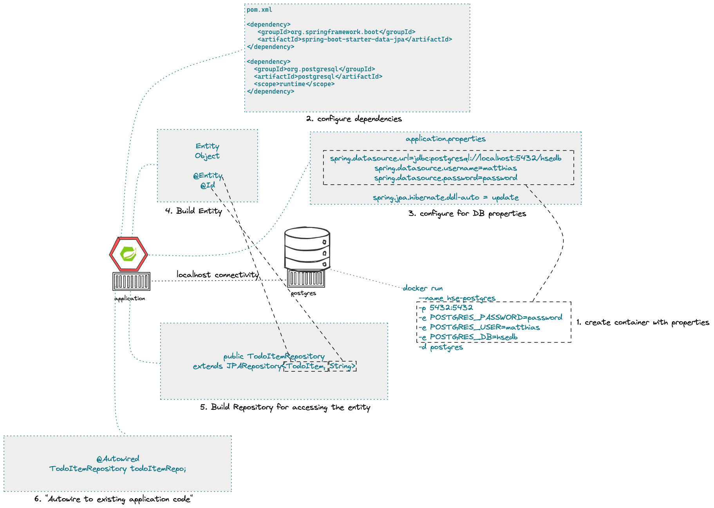

# Distributed Systems Lecture - Winter Semester 2022 - HSE

## Session 26-Sep-2022 Distributed Systems & Cloud Computing Introduction

### Intro questions:

* Which technologies or what do you have in mind in general if you think about "distributed systems"?
* the "WHY" - Why would people use and implement a distributed systems architecture?


### Content

* Why distributed systems?
* What is Cloud Computing? Encounters in everyday life and history
* Characteristic, advantages & challenges
* Terminology - public, private, hybrid, dedicated
* Abstraction layers - IaaS, PaaS, FaaS, SaaS
* Overview - Hypervisors, virtual machines, containers and orchestration

### Objectives and exercises
_The student is able to describe the reasons for distributed systems and
cloud computing in own words and list examples for offerings, topologies and technologies. Includes ability to differentiate between different abstraction layers and knowledge how those layers and according technologies interact with each other. No exercises in this module_

### Links:

* https://landscape.cncf.io/
* https://csrc.nist.gov/publications/detail/sp/800-145/final
* https://spring.io/tools

### Tools:

* https://www.jetbrains.com/idea/
* https://code.visualstudio.com/docs/java/java-tutorial
* https://marketplace.visualstudio.com/items?itemName=Pivotal.vscode-boot-dev-pack
* https://www.gitpod.io

### Review questions

* "WHY" Cloud? Explain advantages (and disadvantages) IN YOUR OWN WORDS!
* Sketch a Cloud abstraction layer diagram and provide technology/provider samples for each
* "aas" - Explain the term service as opposed to a product (in the context of cloud)

## Session 10-Oct-2022 Container & Docker

* What are containers and how do they work?
* Containers vs. VMs
* History of containers and rise of Docker
* Docker concepts: daemon, hub, dockerfile, CLI
* Running containers with various options


### Objectives

_The student understands the concepts and use cases of container technology and is able to describe them. The first exercise is to pull sample images from an image registry (e.g. Docker Hub) and interact with them (run, expose port, execute shell, cleanup etc). After that the student can show how to build a custom image via Dockerfile and push it to a registry for others to access. Complete the exercises handed out via URL._

### Exercises/Lab task

* Create or get yourself a Docker Id (https://www.docker.com)
* Do the container lab given at: https://hfthse.trainings.nvtc.io/

### Review questions

* "WHY" Containers? List advantages/disadvantages ..
* What is the difference between a container and a VM? List 3 criteria
* Which technologies led to the evolution of docker (and why)? 
* What is the difference between a docker daemon and the docker hub? 
* What is the difference between docker run, docker pull and docker start?
* Which command transitions from a container instance to an image?
* What are the Docker components and describe them?
* What does docker exec do? Provide a pseudo-code example and explain what it does 

## Session 17-Oct-2022 Introduction to Spring and Spring Boot

* Background: Spring Framework - History & components
* Spring ← → Spring Boot
* Spring Initializr (start.spring.io) & starter dependencies
* Basic project structure (folders, configuration ..)
* "Hello, World!" example explained
* Using Actuator


### Objectives

The student is able to build and configure an own Spring Boot application from scratch with the IDE of choice. The exercise is to build an own "Hello, World!" application that exposes various - endpoints and is able to execute CRUD operations on the state of the application. Optional: Add logging and testing, configure Actuator.

### Exercises/Lab task

* Create a first project from Spring Initializr at: https://start.spring.io/
* Edit in your editor of choice.
* Optional: Try gitpod as cloud-based editor https://gitpod.io/
* Experiment with starter dependencies. Recommended: Spring Web, Actuator, DevTools
* Expose a public REST endpoint for a GET Call.
* Pass a variable to the application using the @PathVariable annotation.

### Links

* https://start.spring.io/
* https://gitpod.io/
* https://spring.io/guides/gs/rest-service/ (or basically Spring Guides in general)
* https://www.baeldung.com/spring-pathvariable (or basically all Baeldung guides)

### Review questions

* "WHY" Spring Boot? "WHY" Frameworks?
* What is the difference (and common aspects) between Spring and Spring Boot?
* What is the web page to start building your spring boot apps?
* What kind of things can you configure on that Initializr? 
* What is the role of the Actuator?
* If you don't know the actuator list 3 other starter dependencies and explain briefly what they do?

## Session 24-Oct-2022 API, Rest & HTTP

* Synchronous communication
* HTTP and REST
* Verbs, Resources, Nouns
* Evolution, Richardson Maturity Model
* CRUD Operations
* Building a REST API with Spring (Boot)
* Building a data model with REST


### Objectives and exercises
_The student understands the concepts of an API and synchronous communication in distributed systems and can explain it in own words._


### Exercise/Lab Task

* Create a full CRUD Rest API on your application
* The API object is a simple Java object with the following field
````
    private String todo;
    private int priority = 2;
````
* A RestController class is supposed to have an internal list of these objects and provide CRUD functionality.
* Starter sample is given in the git repo.

Links:

* https://restfulapi.net/idempotent-rest-apis/
* https://restfulapi.net/richardson-maturity-model/
* https://en.wikipedia.org/wiki/List_of_HTTP_status_codes

* https://www.baeldung.com/spring-requestmapping
* https://www.baeldung.com/spring-request-response-body
* https://www.baeldung.com/spring-rest-openapi-documentation
* https://www.baeldung.com/spring-cors

### Review questions

* Identify good and bad API examples and explain why
* Describe the concepts of Verbs and Nouns
* When is an invocation idempotent and safe? What does it mean? Provide examples
* Describe in your own words the mapping of REST calls to database (SQL) and CRUD calls
## Session 31-Oct-2022 API, Rest & HTTP continued


### Exercise/Lab Task

* Watch the video I uploaded :-)
* Exercises given there

## Session 07-Nov-2022 Frontend & Backend


## Session 14-Nov-2022 Microservices (Theory)


* CAP Theorem
* Conway's Law
* Fallacies of distributed computing
* Domain-Driven Design basics
* 12-factor application
* Evolution of applications and deployments: Monolithic -> Service-Oriented Architecture -> Microservices
* Introduction to serverless and FaaS terminology

### Objectives and exercises
_The student knows about the evolution of distributed systems (and middleware) and the drivers towards state-of-the-art implementation and deployment. She/he can explain the underlying concepts and theories and put it into practical context. No dedicated exercises for this module. Recap of basics: Spring Boot, Docker, configuration, persistence and messaging._

### Review questions

* "WHY" Cloud-Native Software? What IS Cloud-Native Software?
* Why "evolution" from a monolithic approach to a distributed approach?
* How does the CAP Theorem/Conway's Law relate to this?
* (NO Domain-Driven Design questions)
* How do the 12-factor application "methodology" relate to the technologies that we covered in this semester? (important)
* "WHY" is external configuration important in cloud-native software?
* Where did you see aspects of external configuration in the technologies we used? Provide examples

## Session 21-Nov-2022 cancelled

## Session 28-Nov-2022 Persistence & Spring Data JPA

* Spring Data
* Concept of entities and repositories
* JPA and JDBC basics
* H2, PostgeSQL, MySQL - configuration via Spring Boot profiles
* Running databases as Docker images



### Objectives and exercises
_The student is able to build a Spring Boot application (or extend an existing one) with Spring Data configuration. The exercise is to create an application, which performs CRUD operations on a database backend. The database can either be in-memory (H2) or a (containerized) PostgreSQL. Optional: Provide a docker-compose file to stand up a multi-container environment with application and database._

### Review Questions

* "WHY" persistence? "WHY" persistence frameworks like JPA?
* Describe the necessary components to build an application with Spring Data? Potentially sketch
* What does the annotation @Entity do? 
* How could docker compose help if you have a persistence-based application?

## Session 05-Dev-2022 Advanced Docker - docker-compose & network


## Session 12-Dec-2022 Advanced Docker - volumes & docker-compose recap


### Review questions

* "WHY" do you need an enterprise architecture? What are the requirements?
* How can you solve these problems with framework or containers?
* "At which do you need more?"
* "What else do you need?"
